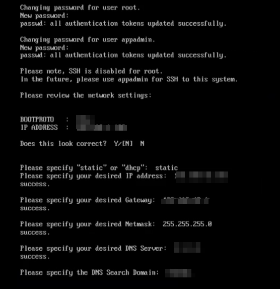
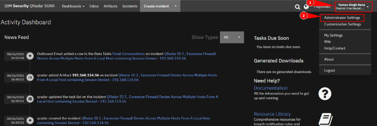
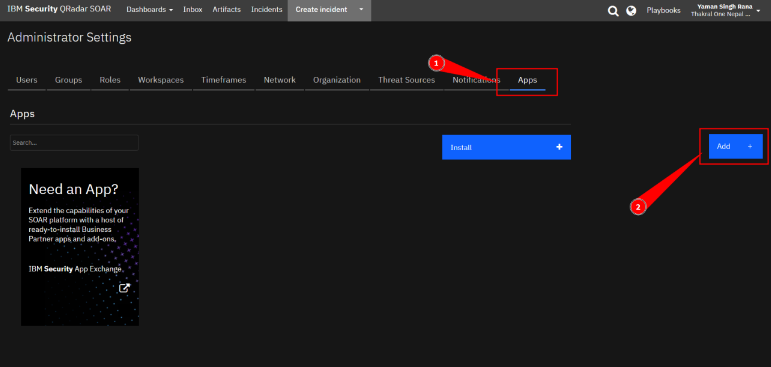
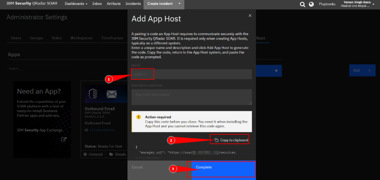

### a. Login to the SOAR APPHOST via CLI from ESXi console

Access the AppHost VM console from ESXi and complete the guided initialization
(network, credentials, DNS).



### b. Change the hostname and timezone

```bash
sudo hostnamectl set-hostname soarapp.<yourdomain>
sudo timedatectl set-timezone Asia/Kathmandu
```
---

### c. Install dependency packages

```bash
sudo dnf install container-selinux selinux-policy-targeted createrepo wget -y
```

---

### d. Create pairing credentials in SOAR

Navigate to **Administrative Settings** and generate pairing credentials.



### e. Navigate to Apps > Add +

Go to **Administrator Settings → Apps → Add (+)**.



### f. Generate pairing token

Add the AppHost name, generate the pairing token, and copy it.



### g. Save `pair.json` and pair AppHost

```bash
cd /opt/
sudo manageAppHost install -p pair.json
```
### h. Verify Kubernetes pods

```bash
kubectl get pods -A -w
```
### i. Verify AppHost in SOAR

Confirm the AppHost status shows **Running** in the SOAR Apps console.


